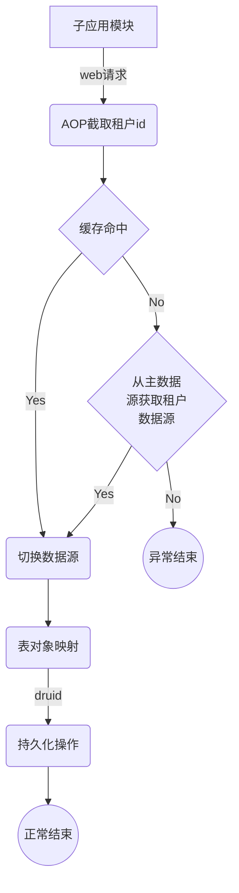
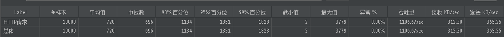
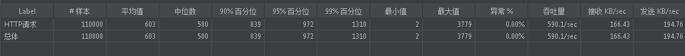
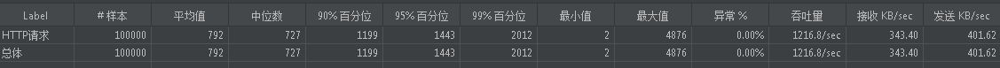

# dynamic-datasource-core
#### 一、业务描述：
1. 系统中的租户，每个租户拥有独立数据库连接源，不同的租户的数据，会存储到各自远程数据库的数据库中。
2. 系统中不同的租户的请求需要进行拦截，根据租户id (`tenantId`)，动态获取操作各自对应的数据库信息。
3. 可在对应租户数据库中执行请求中的SQL字符串语句。

#### 二、主要配置资源文件：
1. `src/main/resources/application.yml` ---> 包括redis\默认主数据源连接配置。
2. `src/main/java/com/amanoisuno/dynamicdatasource/common/GeneratorCommon.java` ---> `mybatis-plus-generator`配置运行包，主要修改参数： 
   1. `preFileName` ---> 包前缀名，对应`src/main/java/com/amanoisuno/dynamicdatasource/config/factory/ServiceFactory.java`中的`articleStringArray`属性拼接`_`。
   2. `dsc` ---> 对应表数据库连接信息。
   3. `PackageConfig getPackageConfig()` ---> 对应生成文件存放路径。
3. `src/main/resources/smart-doc.json` ---> smart-doc及torna配置信息。

#### 三、后续优化
- [ ] 对租户数据库对应service等bean考虑启动懒加载机制及自动销毁机制。
- [ ] 分布式事务管理。

#### 四、使用说明
1. 修改`src/main/java/com/amanoisuno/dynamicdatasource/common/GeneratorCommon.java`中配置，生成租户数据库entity及相关service等文件。
2. 在`src/main/resources/application.yml`使用的主数据源上的`database_detail`表中维护租户数据库连接信息。
3. 接口请求头中添加`tenantId`。

#### 五、处理流程图

#### 六、当前性能效果

修改校验框架后测试效果
